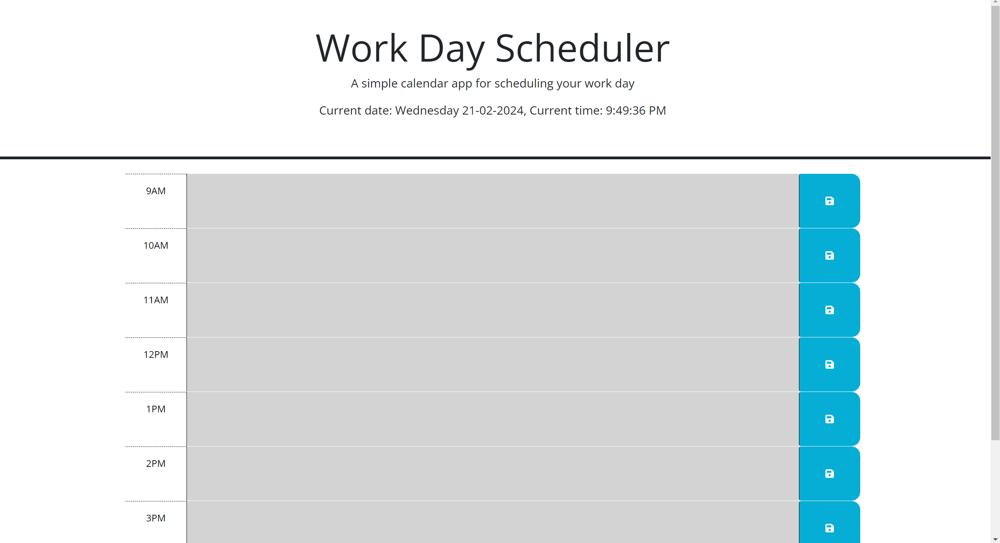
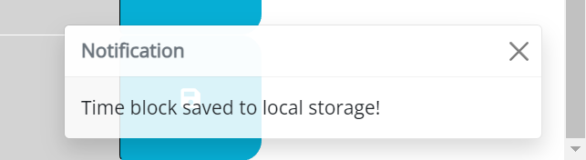
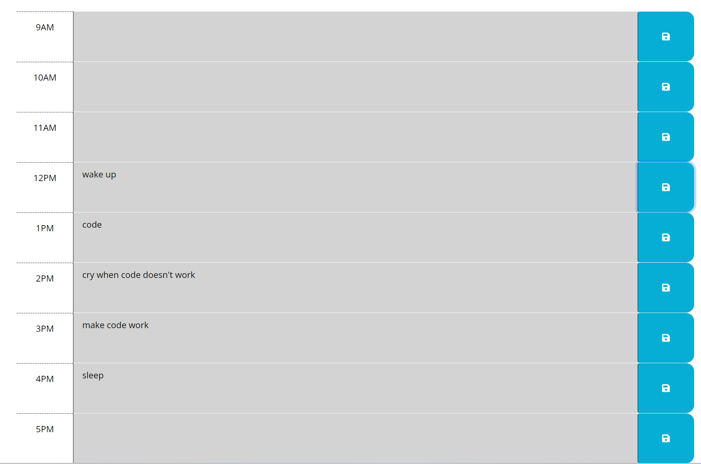

# Daily-Planner

## Description
This daily planner can be used to keep track of a person's daily tasks throughout business hours. I was encouraged to build this in order to gain experience using jquery, bootstrap and dayjs. It has been a good introduction to third party API's for me. My biggest challenge was jquery. Till now I haven't deviated from the standard javascript language so getting used to the jquery abbreviations was a challenge and required me to go out and research alot more.

## Installation
No installation is needed, simply follow the link provided! https://lwse13.github.io/Daily-Planner/

## Usage
when the page loads you will be able to input whatever you like into the chosen time block text area, from there you can hit the save button adjacent to the text area and a save notification will be shown as shown in the image below

Once you have saved your time blocks you can reload or close the page and your time block text will be stored for the next time you open the page

## Credits
N/A

## License
N/A
